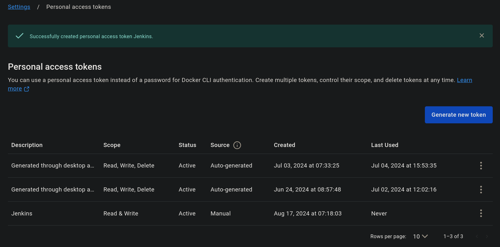

1. **Install Jenkins:**
    - Install Jenkins: https://medium.com/@ranjith_99360/how-to-install-jenkins-on-ubuntu-22-04-17b99fd41678
    Install Java
    
    ```bash
    sudo apt update
    sudo apt install fontconfig openjdk-17-jre
    java -version
    openjdk version "17.0.8" 2023-07-18
    OpenJDK Runtime Environment (build 17.0.8+7-Debian-1deb12u1)
    OpenJDK 64-Bit Server VM (build 17.0.8+7-Debian-1deb12u1, mixed mode, sharing)
    
    #jenkins
    sudo wget -O /usr/share/keyrings/jenkins-keyring.asc \
    https://pkg.jenkins.io/debian-stable/jenkins.io-2023.key
    echo deb [signed-by=/usr/share/keyrings/jenkins-keyring.asc] \
    https://pkg.jenkins.io/debian-stable binary/ | sudo tee \
    /etc/apt/sources.list.d/jenkins.list > /dev/null
    sudo apt-get update
    sudo apt-get install jenkins
    sudo systemctl start jenkins
    sudo systemctl enable jenkins
    ```
    
    - Access Jenkins in a web browser
        
        IP:8080

2. **Install SonarQube and Trivy:**
    - Install SonarQube and Trivy to scan for vulnerabilities.
        
        **sonarqube**:
        ```
        docker run -d --name sonar -p 9000:9000 sonarqube:lts-community
        ```
        **or local**

        
        To access: 
        
        IP:9000 (by default username & password is admin)
        
        To install **Trivy**:
        ```
        sudo apt-get install wget apt-transport-https gnupg lsb-release
        wget -qO - https://aquasecurity.github.io/trivy-repo/deb/public.key | sudo apt-key add -
        echo deb https://aquasecurity.github.io/trivy-repo/deb $(lsb_release -sc) main | sudo tee -a /etc/apt/sources.list.d/trivy.list
        sudo apt-get update
        sudo apt-get install trivy        
        ```
        
        to scan image using trivy
        ```
        trivy image <imageid>
        ```
        
        
3. **Install Necessary Plugins in Jenkins:**

Goto Manage Jenkins →Plugins → Available Plugins →

Install below plugins

1 Eclipse Temurin Installer (Install without restart)

2 SonarQube Scanner (Install without restart)

3 NodeJs Plugin (Install Without restart)

4 OWASP Dependency-Check

5 Docker 
  - Docker
  - Docker Commons
  - Docker Pipeline
  - Docker API
  - docker-build-step

### **Configure Tools **

Goto Manage Jenkins → Tools → 
Install 
JDK(17) name:jdk17

NodeJs(16) name:node16  

OWASP Dependency-Check  name:DP-Check

SonarQube Scanner installations -name:sonar-scanner

Docker 

Apply and Save

### SonarQube

Create the token in SonrQubeIP:9000 (by default username & password is admin) 


Goto Jenkins Dashboard → Manage Jenkins → Credentials → Add Secret Text. 


**Webhooks**
Webhooks are used to notify external services when a project analysis is done.
add your Jenkins Server 
http://JenkinsServer:8080/sonarqube-webhook/ # if you add secret you need add it in Manage Jenkins → System → SonarQube servers advance 


Site=https://docs.sonarsource.com/sonarqube/9.9/analyzing-source-code/scanners/jenkins-extension-sonarqube/

Goto Manage Jenkins → System → SonarQube servers 

Name: sonarqube-server
Server URL: http://localhost:9000        ##(ServerIP)
Server authentication token 


**Add DockerHub Credentials:**

- To securely handle DockerHub credentials in your Jenkins pipeline, follow these steps:
  - Go to "Dashboard" → "Manage Jenkins" → "Manage Credentials."
  - Click on "System" and then "Global credentials (unrestricted)."
  - Click on "Add Credentials" on the left side.
  - Choose "Secret text" as the kind of credentials.
  - Enter your DockerHub credentials (Username and Docker Token ) and give the credentials an ID (e.g., "docker-cred").
  - Click "OK" to save your DockerHub credentials.

Docker-Hub Token:

Jenkins Credentials:


**Kuberntes RBAC Role for Jenkins**

  Create Service Account, Role & Assign that role, And create a secret for Service Account and geenrate a Token
Creating Service Account

```
kubectl create namespace twitter-website
```

```
apiVersion: v1
kind: ServiceAccount
metadata:
  name: jenkins
  namespace: twitter-website
```
Create Role

```
apiVersion: rbac.authorization.k8s.io/v1
kind: Role
metadata:
  name: app-role
  namespace: twitter-website
rules:
  - apiGroups:
        - ""
        - apps
        - autoscaling
        - batch
        - extensions
        - policy
        - rbac.authorization.k8s.io
    resources:
      - pods
      - componentstatuses
      - configmaps
      - daemonsets
      - deployments
      - events
      - endpoints
      - horizontalpodautoscalers
      - ingress
      - jobs
      - limitranges
      - namespaces
      - nodes
      - pods
      - persistentvolumes
      - persistentvolumeclaims
      - resourcequotas
      - replicasets
      - replicationcontrollers
      - serviceaccounts
      - services
    verbs: ["get", "list", "watch", "create", "update", "patch", "delete"]
```

Bind the role to service account

```
apiVersion: rbac.authorization.k8s.io/v1
kind: RoleBinding
metadata:
  name: app-rolebinding
  namespace: twitter-website
roleRef:
  apiGroup: rbac.authorization.k8s.io
  kind: Role
  name: app-role 
subjects:
- namespace: twitter-website
  kind: ServiceAccount
  name: jenkins 
```
    
Create Token

```
apiVersion: v1
kind: Secret
type: kubernetes.io/service-account-token
metadata:
  name: nm-twitter-website-secret
  annotations:
    kubernetes.io/service-account.name: nm-twitter-website-secret
```

Errors:
docker: permission denied while trying to connect to the Docker daemon socket at unix:///var/run/docker.sock: Head "http://%2Fvar%2Frun%2Fdocker.sock/_ping": dial unix /var/run/docker.sock: connect: permission denied.

sudo usermod -aG  docker jenkins 
or ! 
sudo  chmod +777 /var/run/docker.sock


Temp:
Test mail server 
docker run -d --rm -p  1080:1080 -p 25:1025 maildev/maildev


Sites:
https://mrcloudbook.com/jenkins-ci-cd-dotnet-webapp-devsecops-project/


// put this file in the branches of the application/software repository

node {    
    //checkout main project files
    // need to manually checkout in scripted pipeline (differs from declarative pipeline which checkouts by default)
    scmVars = checkout scm

    //checkout devops repository (other repository)
    sh 'mkdir -p devops'
	dir("devops")
    {
        script{
            git branch: "main", 
                url: 'https://github.com/muratdemiray/jenkins-pipeline-load-devops.git'            
        }
    }
    
    // pass the environment variables to new pipeline
    withEnv(["COMMIT=${scmVars.GIT_COMMIT}","BRANCH=${scmVars.GIT_BRANCH}"]) {    
        // load Jenkinsfile Pipeline file from devops repository     
        load 'devops/project_A/full-pipeline.Jenkinsfile'  
    }
} 